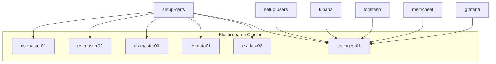

# docker-compose-elk

운영형에 더 가까운 ELK + Grafana 예제입니다. Elasticsearch는 역할을 분리한 클러스터로 구성하고, `setup` 컨테이너가 인증서와 서비스 계정을 자동으로 준비합니다.

## 구성

- `setup-certs`: 노드 간 transport TLS 인증서를 생성합니다.
- `es-master01~03`: 전용 마스터 노드 3개입니다.
- `es-data01~02`: 전용 데이터 노드 2개입니다.
- `es-ingest01`: 전용 ingest/coordinating 노드입니다. 외부 API 진입점도 맡습니다.
- `setup-users`: `kibana_system`, `logstash_internal`, `metricbeat_internal`, `grafana_internal` 계정을 자동 생성/갱신합니다.
- `kibana`: `kibana_system` 계정으로 클러스터에 연결됩니다.
- `logstash`: `logstash_internal` 계정으로 로그를 적재합니다.
- `metricbeat`: `metricbeat_internal` 계정으로 Stack/Docker 메트릭을 수집합니다.
  - 전용 master 노드가 있는 클러스터를 고려해 `scope: cluster`를 사용합니다.
- `grafana`: `grafana_internal` 계정으로 Elasticsearch datasource를 사용합니다.



## 시작 방법

```bash
cd elk
cp .env.example .env
docker compose up -d --build
```

## 샘플 로그 테스트

텍스트 로그와 JSON 로그 예제를 함께 넣어 두었습니다.

```bash
cd elk
cat testdata/logstash-sample.log | nc localhost 50000
```

## 기본 버전

- Elastic Stack: `9.3.1`
- Grafana OSS: `11.5.2`

## 운영 메모

- Kibana 로그인은 `elastic` 사용자와 `.env`의 `ELASTIC_PASSWORD`를 사용하면 됩니다.
- 운영에서는 HTTP 레이어도 TLS를 켜는 편이 안전하지만, 현재 예제는 내부 Docker 네트워크 간 단순화를 위해 transport TLS만 켭니다.
- ingest 노드는 외부 진입점 역할을 하고, master/data 역할은 분리했습니다.
- 기본 메모리 값은 Docker Desktop 8GB 전후 환경도 고려해 보수적으로 잡았습니다.
- Metricbeat 기본 수집 주기는 `30s`로 두는 편이 운영형 예제에서 더 안정적입니다.
