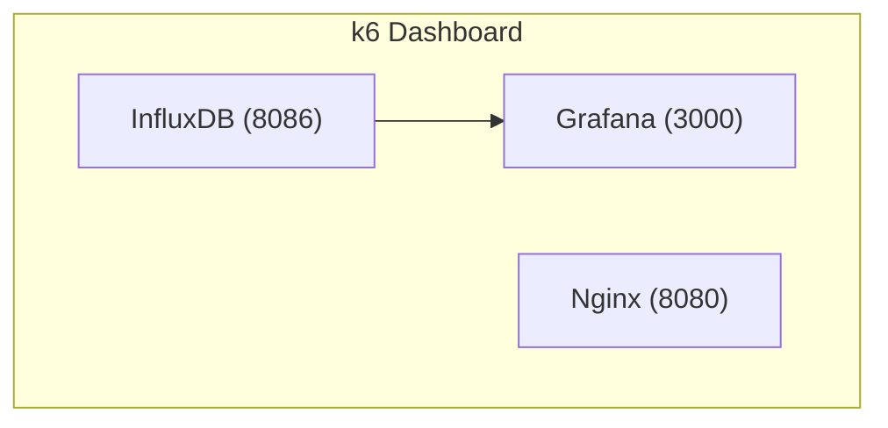

# k6-dashboard

k6 부하 테스트 결과를 InfluxDB와 Grafana로 확인하기 위한 로컬 대시보드 샘플입니다.

## 구성



## 실행

```bash
cp .env-sample .env
docker compose up -d
```

## 접속 정보

- InfluxDB: `http://127.0.0.1:${INFLUXDB_PORT}`
- Grafana: `http://127.0.0.1:${GRAFANA_PORT}`
- Nginx: `http://127.0.0.1:${NGINX_PORT}`
- Nginx Ping: `http://127.0.0.1:${NGINX_PORT}/ping`

## 특징

- 이미지 버전과 노출 포트는 `.env`에서 관리합니다.
- Grafana는 `depends_on.condition: service_healthy`로 InfluxDB 준비 후 실행됩니다.
- InfluxDB와 Grafana 데이터는 named volume에 저장됩니다.
- Grafana 프로비저닝 파일과 Nginx 설정은 로컬 파일을 읽기 전용으로 마운트합니다.

## 정리

```bash
docker compose down
```

데이터까지 함께 삭제하려면 아래 명령을 사용합니다.

```bash
docker compose down -v
```
