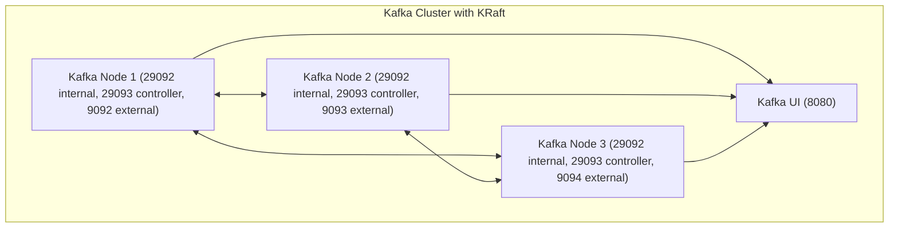

# kafka-cluster-with-KRaft

KRaft 기반 3노드 Kafka 클러스터 로컬 개발환경입니다.

## 구성



## 실행

`.env`를 확인하고 필요한 값을 조정한 뒤 실행합니다.

```bash
cp .env-sample .env
docker compose --env-file .env up -d
```

## 환경 변수

- `KAFKA_1_PORT`, `KAFKA_2_PORT`, `KAFKA_3_PORT`
  - 호스트에서 접근할 외부 포트입니다.
  - 컨테이너 내부 Kafka EXTERNAL listener는 `${KAFKA_EXTERNAL_PORT}`를 사용합니다.
- `KAFKA_INTERNAL_PORT`, `KAFKA_CONTROLLER_PORT`, `KAFKA_EXTERNAL_PORT`
  - KRaft 내부 통신과 외부 listener의 컨테이너 포트입니다.
- `KAFKA_CLUSTER_ID`
  - KRaft 클러스터 식별자입니다.
- `DOCKER_HOST_IP`
  - 브로커가 외부 클라이언트에게 광고할 호스트 IP입니다.
- `KAFKA_IMAGE`, `KAFKA_UI_IMAGE`
  - 실행할 이미지와 버전을 관리합니다.
- `KAFKA_UI_PORT`
  - Kafka UI 포트입니다.
- `PROFILE`
  - Kafka UI에 표시할 클러스터 이름입니다.

## 접속 정보

- 내부 브로커 주소:
  - `kafka-1:${KAFKA_INTERNAL_PORT}`
  - `kafka-2:${KAFKA_INTERNAL_PORT}`
  - `kafka-3:${KAFKA_INTERNAL_PORT}`
- 외부 브로커 주소:
  - `${DOCKER_HOST_IP}:${KAFKA_1_PORT}`
  - `${DOCKER_HOST_IP}:${KAFKA_2_PORT}`
  - `${DOCKER_HOST_IP}:${KAFKA_3_PORT}`
- Kafka UI: `http://127.0.0.1:${KAFKA_UI_PORT}`

## 특징

- 내부 listener는 서비스명 기반으로 고정해 브로커 간 통신 안정성을 높였습니다.
- 외부 노출 포트만 `.env`에서 바꿀 수 있게 정리해 포트 변경 시 설정 불일치를 줄였습니다.
- 이미지 버전도 `.env`에서 함께 관리합니다.
- 각 노드는 broker/controller 역할을 함께 수행합니다.
- 데이터는 named volume에 저장됩니다.

## 토픽 생성 예제

```bash
docker compose --env-file .env exec kafka-1 kafka-topics \
  --bootstrap-server kafka-1:${KAFKA_INTERNAL_PORT} \
  --create \
  --topic sample-topic \
  --partitions 3 \
  --replication-factor 3
```

토픽 목록 확인:

```bash
docker compose --env-file .env exec kafka-1 kafka-topics \
  --bootstrap-server kafka-1:${KAFKA_INTERNAL_PORT} \
  --list
```

## 테스트용 Producer / Consumer

Producer:

```bash
docker compose --env-file .env exec kafka-1 kafka-console-producer \
  --bootstrap-server kafka-1:${KAFKA_INTERNAL_PORT} \
  --topic sample-topic
```

Consumer:

```bash
docker compose --env-file .env exec kafka-1 kafka-console-consumer \
  --bootstrap-server kafka-1:${KAFKA_INTERNAL_PORT} \
  --topic sample-topic \
  --from-beginning
```

## Kafka UI 확인 포인트

Kafka UI 접속 주소:

```text
http://127.0.0.1:${KAFKA_UI_PORT}
```

확인하면 좋은 항목:

- 클러스터 목록에서 `${PROFILE}` 이름의 클러스터가 보이는지 확인합니다.
- Brokers 화면에서 `kafka-1`, `kafka-2`, `kafka-3`가 모두 표시되는지 확인합니다.
- Topics 화면에서 `sample-topic`이 생성되어 있는지 확인합니다.
- `sample-topic` 상세 화면에서 파티션 수가 `3`이고 replica가 3개로 잡혀 있는지 확인합니다.
- Zookeeper를 사용하지 않는 KRaft 모드인지 확인합니다.
- Messages 탭에서 producer로 넣은 메시지가 조회되는지 확인합니다.

## 정리

```bash
docker compose --env-file .env down
```

데이터까지 함께 삭제하려면 아래 명령을 사용합니다.

```bash
docker compose --env-file .env down -v
```
