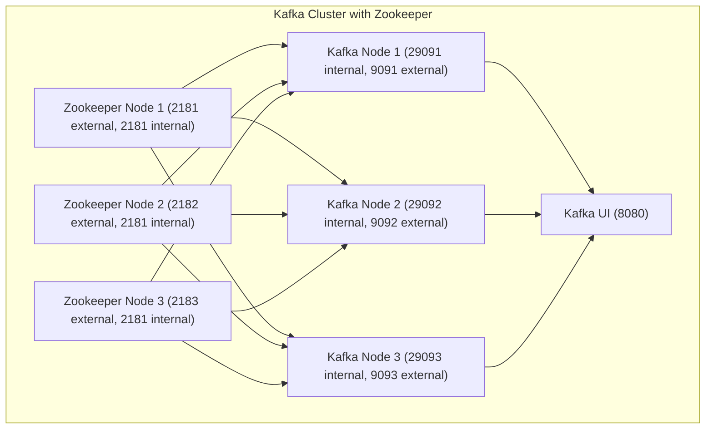

# kafka-cluster-with-zookeeper

Zookeeper 3노드 ensemble과 Kafka 3노드로 구성한 로컬 개발환경입니다.

## 구성



## 실행

`.env`를 확인하고 필요한 값을 조정한 뒤 실행합니다.

```bash
cp .env-sample .env
docker compose up -d
```

## 접속 정보

- Broker 1 외부 접속 주소: `${KAFKA_HOST_IP}:${KAFKA_1_EXTERNAL_PORT}`
- Broker 2 외부 접속 주소: `${KAFKA_HOST_IP}:${KAFKA_2_EXTERNAL_PORT}`
- Broker 3 외부 접속 주소: `${KAFKA_HOST_IP}:${KAFKA_3_EXTERNAL_PORT}`
- Zookeeper 외부 접속 주소:
  - `127.0.0.1:${ZOOKEEPER_1_EXTERNAL_PORT}`
  - `127.0.0.1:${ZOOKEEPER_2_EXTERNAL_PORT}`
  - `127.0.0.1:${ZOOKEEPER_3_EXTERNAL_PORT}`
- 내부 브로커 주소:
  - `kafka-1:${KAFKA_1_INTERNAL_PORT}`
  - `kafka-2:${KAFKA_2_INTERNAL_PORT}`
  - `kafka-3:${KAFKA_3_INTERNAL_PORT}`
- 내부 Zookeeper ensemble 주소:
  - `zookeeper-1:${ZOOKEEPER_CLIENT_PORT}`
  - `zookeeper-2:${ZOOKEEPER_CLIENT_PORT}`
  - `zookeeper-3:${ZOOKEEPER_CLIENT_PORT}`
- Kafka UI: `http://127.0.0.1:${KAFKA_UI_PORT}`

## 특징

- Zookeeper는 3대 ensemble로 구성되어 quorum 기반으로 동작합니다.
- 각 브로커는 명시적인 listener 설정을 사용합니다.
- 내부 통신 listener와 외부 노출 listener를 분리했습니다.
- 이미지 버전은 `.env`에서 관리합니다.
- replication 관련 기본값을 3노드 클러스터에 맞게 설정했습니다.
- 브로커와 각 Zookeeper 데이터는 named volume에 저장됩니다.

## 토픽 생성 예제

```bash
docker compose exec kafka-1 kafka-topics \
  --bootstrap-server kafka-1:${KAFKA_1_INTERNAL_PORT} \
  --create \
  --topic sample-topic \
  --partitions 3 \
  --replication-factor 3
```

토픽 목록 확인:

```bash
docker compose exec kafka-1 kafka-topics \
  --bootstrap-server kafka-1:${KAFKA_1_INTERNAL_PORT} \
  --list
```

## 테스트용 Producer / Consumer

Producer:

```bash
docker compose exec kafka-1 kafka-console-producer \
  --bootstrap-server kafka-1:${KAFKA_1_INTERNAL_PORT} \
  --topic sample-topic
```

Consumer:

```bash
docker compose exec kafka-1 kafka-console-consumer \
  --bootstrap-server kafka-1:${KAFKA_1_INTERNAL_PORT} \
  --topic sample-topic \
  --from-beginning
```

## Kafka UI 확인 포인트

Kafka UI 접속 주소:

```text
http://127.0.0.1:${KAFKA_UI_PORT}
```

확인하면 좋은 항목:

- 클러스터 목록에서 `${KAFKA_CLUSTER_NAME}` 이름의 클러스터가 보이는지 확인합니다.
- Brokers 화면에서 `kafka-1`, `kafka-2`, `kafka-3`가 모두 표시되는지 확인합니다.
- Topics 화면에서 `sample-topic`이 생성되어 있는지 확인합니다.
- `sample-topic` 상세 화면에서 파티션 수가 `3`이고 replica가 3개로 잡혀 있는지 확인합니다.
- Zookeeper 화면이 보인다면 `zookeeper-1`, `zookeeper-2`, `zookeeper-3`가 ensemble로 인식되는지 확인합니다.
- Zookeeper 연결 정보가 `zookeeper-1:2181,zookeeper-2:2181,zookeeper-3:2181`로 표시되는지 확인합니다.
- Messages 탭에서 producer로 넣은 메시지가 조회되는지 확인합니다.

## 정리

```bash
docker compose down
```

데이터까지 함께 삭제하려면 아래 명령을 사용합니다.

```bash
docker compose down -v
```
