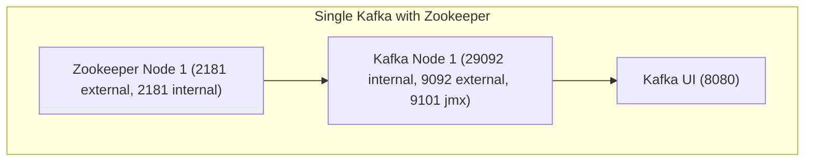

# single-kafka-with-zookeeper

Zookeeper 기반 단일 브로커 로컬 개발환경입니다.

## 구성



## 실행

```bash
cp .env-sample .env
docker compose up -d
```

## 접속 정보

- Kafka 내부 브로커 주소: `kafka:${KAFKA_INTERNAL_PORT}`
- Kafka 외부 접속 주소: `${KAFKA_HOST_IP}:${KAFKA_EXTERNAL_PORT}`
- Zookeeper: `127.0.0.1:${ZOOKEEPER_PORT}`
- Kafka UI: `http://127.0.0.1:${KAFKA_UI_PORT}`

## 특징

- `healthcheck` 기반으로 Zookeeper 준비 후 Kafka가 올라옵니다.
- Kafka UI는 Kafka와 Zookeeper가 모두 준비된 뒤 실행됩니다.
- 이미지 버전은 `.env`에서 관리합니다.
- Kafka/Zookeeper 데이터는 named volume에 저장됩니다.

## 토픽 생성 예제

```bash
docker compose exec kafka kafka-topics \
  --bootstrap-server kafka:${KAFKA_INTERNAL_PORT} \
  --create \
  --topic sample-topic \
  --partitions 1 \
  --replication-factor 1
```

토픽 목록 확인:

```bash
docker compose exec kafka kafka-topics \
  --bootstrap-server kafka:${KAFKA_INTERNAL_PORT} \
  --list
```

## 테스트용 Producer / Consumer

Producer:

```bash
docker compose exec kafka kafka-console-producer \
  --bootstrap-server kafka:${KAFKA_INTERNAL_PORT} \
  --topic sample-topic
```

Consumer:

```bash
docker compose exec kafka kafka-console-consumer \
  --bootstrap-server kafka:${KAFKA_INTERNAL_PORT} \
  --topic sample-topic \
  --from-beginning
```

## Kafka UI 확인 포인트

Kafka UI 접속 주소:

```text
http://127.0.0.1:${KAFKA_UI_PORT}
```

확인하면 좋은 항목:

- 클러스터 목록에서 `${KAFKA_CLUSTER_NAME}` 이름의 클러스터가 보이는지 확인합니다.
- Brokers 화면에서 단일 브로커 `kafka`가 표시되는지 확인합니다.
- Topics 화면에서 `sample-topic`이 생성되어 있는지 확인합니다.
- `sample-topic` 상세 화면에서 파티션 수가 `1`이고 replica가 1개로 잡혀 있는지 확인합니다.
- Zookeeper 화면이 보인다면 `zookeeper:2181`로 연결되어 있는지 확인합니다.
- Messages 탭에서 producer로 넣은 메시지가 조회되는지 확인합니다.

## 정리

```bash
docker compose down
```

데이터까지 함께 삭제하려면 아래 명령을 사용합니다.

```bash
docker compose down -v
```
