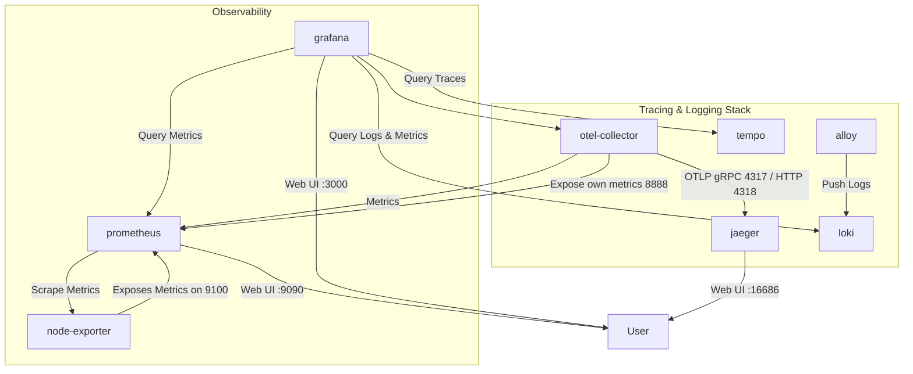

# OpenTelemetry Collector 개발환경

Opentelemetry collector를 별도 구성하고 그에 기반한 trace, metric 및 log 수집

## 개발환경

`opentelemetry/.env-sample`을 복사해서 `.env`를 만들고, 로컬 환경에 맞는 외부 공개 포트/이미지/로그 경로를 조정합니다. 내부 동작 값은 가능한 한 각 서비스 설정 파일이나 compose 정의에 직접 둡니다.

## 구성

- `otel-collector` : OpenTelemetry 데이터를 수집(수신), 처리(Processor), 내보내기(Exporter) 역할을 수행하는 핵심 컴포넌트입니다. 다양한 포맷(OTLP, Prometheus 등)을 지원하여 trace, metric, log 데이터를 집계하고 다른 시스템으로 전달합니다.
- `jaeger` : 트레이싱 데이터를 수집하고, 시각화하는 오픈소스 APM 툴입니다.
- `tempo` : trace 스토리지 백엔드입니다.
- `prometheus` : 시계열 기반의 모니터링 툴입니다. 메트릭 데이터를 수집하고 저장합니다.
- `node-exporter` : Prometheus에서 사용하는 대표적인 exporter로, 시스템의 CPU, Memory, Disk 등 자원 상태를 수집합니다.
- `loki` : 로그 집계 저장 시스템입니다. 
- `alloy` : 호스트 파일 로그를 수집해 loki로 직접 전송하는 로그 수집기입니다. 현재는 파일 로그 수집 전용으로 사용하고, 설정 파일에 OTLP 수신 확장 예시를 주석으로 남겨뒀습니다.
- `grafana` : 메트릭, 로그, 트레이스 등 다양한 관측 데이터를 하나의 UI로 통합하여 시각화하는 플랫폼입니다.




## 실행 방법

1. `.env` 생성

```sh
cd opentelemetry
cp .env-sample .env
```

2. 필요 시 `.env` 값 수정

- 이미지 버전: `*_IMAGE`
- 호스트 공개 포트: `*_HOST_PORT_*`, `GRAFANA_HOST_PORT`, `PROMETHEUS_HOST_PORT`
- Alloy 로그 경로/UI 포트: `ALLOY_LOG_PATH`, `ALLOY_HOST_PORT`
- Compose 프로젝트/네트워크명: `COMPOSE_PROJECT_NAME`, `OTEL_NETWORK_NAME`
- named volume 이름: `*_VOLUME_NAME`
- Tempo/Loki/Grafana 및 Collector 내부 연동 값: 각 설정 파일에서 관리
- Prometheus retention: `docker-compose.yml`의 command 플래그에서 관리

3. 실행

```sh
docker compose up -d
```

4. 종료

```sh
docker compose down
docker compose down -v
```

## Telemetry Data 흐름도


## 구성 파일별 관리 항목

- `docker-compose.yml`
  - `.env`에서 주입되는 이미지 버전
  - `.env`에서 주입되는 외부 공개 포트
  - `.env`에서 주입되는 네트워크명/프로젝트명
  - `.env`에서 주입되는 named volume 이름
  - `.env`에서 주입되는 Alloy 호스트 로그 경로 및 UI 포트
  - Prometheus retention 플래그
- 설정 파일
  - [alloy/config.alloy](/Users/dongjin/dev/study/sample-docker-compose/opentelemetry/alloy/config.alloy): 파일 로그 수집 경로, 라벨 전략, Loki 전송 경로, 향후 OTLP 수신 확장 예시
  - [collector/otel-config.yaml](/Users/dongjin/dev/study/sample-docker-compose/opentelemetry/collector/otel-config.yaml): Collector 수신 주소와 Jaeger/Tempo/Prometheus/Loki exporter 엔드포인트
  - [prometheus/prometheus.yml](/Users/dongjin/dev/study/sample-docker-compose/opentelemetry/prometheus/prometheus.yml): scrape 대상
  - [tempo/tempo.yaml](/Users/dongjin/dev/study/sample-docker-compose/opentelemetry/tempo/tempo.yaml): trace retention, block size
  - [loki/loki.yaml](/Users/dongjin/dev/study/sample-docker-compose/opentelemetry/loki/loki.yaml): log retention, chunk/cache size
  - [grafana/grafana.ini](/Users/dongjin/dev/study/sample-docker-compose/opentelemetry/grafana/grafana.ini): Grafana 메타데이터 retention

내부 서비스명(`otel-collector`, `prometheus`, `tempo`, `loki`, `jaeger`, `node-exporter`)은 설정 파일에서 직접 참조하므로 유지하는 것을 권장합니다.

## Jaeger 구성 메모

- 현재 Jaeger는 `all-in-one` 대신 [jaeger/jaeger.yaml](/Users/dongjin/dev/study/sample-docker-compose/opentelemetry/jaeger/jaeger.yaml) 기반의 Jaeger v2 이미지를 사용합니다.
- 애플리케이션의 OTLP 입력은 `otel-collector`만 host에 공개합니다.
- Jaeger는 compose 내부 네트워크에서만 OTLP를 받아 `otel-collector -> jaeger` 경로로 동작합니다.
- Jaeger trace 데이터는 Badger 스토리지를 사용하며 named volume에 저장됩니다.

## Retention 메모

- Prometheus는 현재 검증한 이미지 기준으로 `prometheus.yml`의 retention 설정을 지원하지 않아, [docker-compose.yml](/Users/dongjin/dev/study/sample-docker-compose/opentelemetry/docker-compose.yml) 의 `--storage.tsdb.retention.time/size` 플래그로 관리합니다.
- Tempo는 compactor의 `block_retention`으로 trace 보존 기간을 제어합니다.
- Loki는 `limits_config.retention_period`와 compactor 설정으로 log 보존 기간을 제어합니다.
- Grafana는 메트릭/로그/트레이스를 직접 저장하지 않으므로, 내부 메타데이터 기준으로 대시보드 버전과 annotation 보존 값을 `grafana.ini`에서 관리합니다.

## 로그 수집 경로 비교

| 항목 | `alloy -> loki` | `alloy -> otel-collector -> loki` |
| --- | --- | --- |
| 공식 문서 흐름 | 기본 추천에 가까움 | 가능한 대안 패턴 |
| 구성 복잡도 | 낮음 | 중간 |
| 장애 지점 | 적음 | Collector 홉이 하나 더 생김 |
| 설정 위치 | Alloy + Loki | Alloy + Collector + Loki |
| 적합한 경우 | 파일 로그 수집기 대체, 로컬 개발, 단순한 운영 | 중앙 라우팅, 공통 attribute 부여, 로그 정책 일원화 |
| 현재 저장소 추천 | 권장 | 필요할 때만 선택 |

## 선택 기준

| 기준 | `alloy -> loki`를 고를 때 | `alloy -> otel-collector -> loki`를 고를 때 |
| --- | --- | --- |
| 목적 | Promtail 대체가 주목적일 때 | 모든 로그를 중앙 Collector 정책 아래 두고 싶을 때 |
| 운영 난이도 | 최대한 단순해야 할 때 | 중앙 제어와 유연성이 더 중요할 때 |
| 로그 가공 | 간단한 라벨링 정도면 충분할 때 | 공통 가공, 라우팅, enrichment가 필요할 때 |
| 현재 스택 적합성 | 높음 | 중간 |

현재 샘플 스택은 `alloy -> loki`를 기본값으로 사용합니다. Grafana 공식 문서 기준으로도 Alloy가 Loki로 직접 보내는 경로가 가장 자연스럽고, 현재 저장소의 목적에도 잘 맞습니다.

## 값 변경 위치

| 항목 | 어디서 바꾸는지 | 이유 |
| --- | --- | --- |
| 이미지 태그 | [\.env-sample](/Users/dongjin/dev/study/sample-docker-compose/opentelemetry/.env-sample) | 환경별 버전 교체가 가장 잦은 값이기 때문입니다. |
| 외부 공개 포트 | [\.env-sample](/Users/dongjin/dev/study/sample-docker-compose/opentelemetry/.env-sample) | 로컬 머신 포트 충돌을 피하려면 환경별 조정이 필요합니다. |
| named volume / network / project name | [\.env-sample](/Users/dongjin/dev/study/sample-docker-compose/opentelemetry/.env-sample) | 로컬 환경 격리와 충돌 방지 목적입니다. |
| Alloy 파일 로그 경로 / UI 포트 | [\.env-sample](/Users/dongjin/dev/study/sample-docker-compose/opentelemetry/.env-sample) | 호스트 경로와 디버그 포트는 환경별 차이가 크기 때문입니다. |
| Alloy 파일 로그 라벨 / Loki 전송 / OTLP 확장 예시 | [alloy/config.alloy](/Users/dongjin/dev/study/sample-docker-compose/opentelemetry/alloy/config.alloy) | 로그 수집기 자체의 동작 정책입니다. |
| Collector 내부 receiver / exporter 주소 | [otel-config.yaml](/Users/dongjin/dev/study/sample-docker-compose/opentelemetry/collector/otel-config.yaml) | 내부 서비스 연결 정보라 설정 파일에 직접 두는 편이 흐름이 명확합니다. |
| Prometheus scrape 대상 | [prometheus.yml](/Users/dongjin/dev/study/sample-docker-compose/opentelemetry/prometheus/prometheus.yml) | Prometheus 고유 설정입니다. |
| Prometheus retention | [docker-compose.yml](/Users/dongjin/dev/study/sample-docker-compose/opentelemetry/docker-compose.yml) | 현재 검증한 버전에서는 `prometheus.yml` 대신 실행 플래그로만 안정적으로 적용됩니다. |
| Tempo retention / block size | [tempo.yaml](/Users/dongjin/dev/study/sample-docker-compose/opentelemetry/tempo/tempo.yaml) | Tempo 내부 저장 정책입니다. |
| Loki retention / chunk/cache size | [loki.yaml](/Users/dongjin/dev/study/sample-docker-compose/opentelemetry/loki/loki.yaml) | Loki 내부 저장 정책입니다. |
| Grafana 메타데이터 retention | [grafana.ini](/Users/dongjin/dev/study/sample-docker-compose/opentelemetry/grafana/grafana.ini) | Grafana 애플리케이션 자체 설정입니다. |

## 로컬 개발 권장 Retention 정책

| 서비스 | 권장값 | 기본값/기본동작 | 설정 위치 |
| --- | --- | --- | --- |
| Prometheus | `time: 15d`, `size: 3GB` | `time` 기본값은 `15d`, `size` 기본값은 `0`(비활성화) | [docker-compose.yml](/Users/dongjin/dev/study/sample-docker-compose/opentelemetry/docker-compose.yml) |
| Tempo | `block_retention: 168h(7d)`, `compaction.max_block_bytes: 5GB`, `ingester.max_block_bytes: 500MB` | `block_retention` 기본값은 `336h(14d)`, `compaction.max_block_bytes` 기본값은 `100GB`, `ingester.max_block_bytes` 기본값은 `500MB` | [tempo/tempo.yaml](/Users/dongjin/dev/study/sample-docker-compose/opentelemetry/tempo/tempo.yaml) |
| Loki | `retention_period: 168h(7d)`, `chunk_target_size: 1.5MB`, `results_cache.max_size_mb: 100` | retention 미설정 시 무기한 보관, `max_query_lookback` 기본값은 `0s`, embedded cache 기본값은 `100` | [loki/loki.yaml](/Users/dongjin/dev/study/sample-docker-compose/opentelemetry/loki/loki.yaml) |
| Grafana | `dashboard versions: 20`, `annotation max_age: 30d` | `versions_to_keep` 기본값은 `20`, annotation `max_age` 기본값은 `0`(무기한) | [grafana/grafana.ini](/Users/dongjin/dev/study/sample-docker-compose/opentelemetry/grafana/grafana.ini) |

Tempo와 Loki의 size 관련 값은 Prometheus의 `retention.size`처럼 "전체 저장소 상한"을 바로 자르는 옵션이 아니라, block/chunk/cache 단위의 크기 제어 값입니다.

## Alloy 메모

- 현재 [alloy/config.alloy](/Users/dongjin/dev/study/sample-docker-compose/opentelemetry/alloy/config.alloy)는 기존 `promtail`의 `job=varlogs`, `__path__=/var/log/*log` 라벨 전략을 최대한 비슷하게 옮긴 설정입니다.
- `wildfly`, `server` 예시는 주석으로 남겨뒀습니다.
- 현재는 파일 로그만 수집하며, 나중에 필요하면 설정 파일 하단의 주석 예시를 바탕으로 OTLP receiver를 추가할 수 있습니다.
