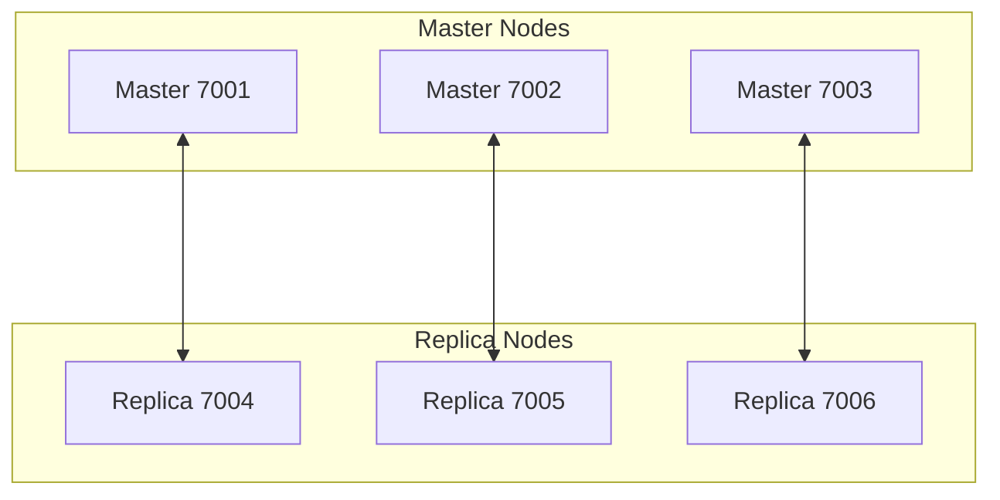

# Redis Cluster

이 Docker Compose 설정은 다음과 같은 Redis Cluster 아키텍처를 구성합니다.

- Redis Master 3개
- Redis Replica 3개

이 예제는 단순 기동 데모가 아니라, 다음 요구를 반영한 구조를 사용합니다.

- 템플릿 설정과 runtime 설정 파일 분리
- `nodes.conf` 및 AOF 데이터 영속화
- 고정 IP 기반 노드 간 통신
- 외부 클라이언트가 `localhost:7001~7006`으로 접근할 수 있도록 announce 설정 반영

## environment

nothing to do.

## composition

- `redis-node-1` : `172.31.0.11`, client port `7001`, bus port `17001`
- `redis-node-2` : `172.31.0.12`, client port `7002`, bus port `17002`
- `redis-node-3` : `172.31.0.13`, client port `7003`, bus port `17003`
- `redis-node-4` : `172.31.0.14`, client port `7004`, bus port `17004`
- `redis-node-5` : `172.31.0.15`, client port `7005`, bus port `17005`
- `redis-node-6` : `172.31.0.16`, client port `7006`, bus port `17006`



## directory structure

```sh
.
├── docker-compose.yml
├── conf/
│   ├── redis-node-1/
│   │   └── redis.conf
│   ├── redis-node-2/
│   │   └── redis.conf
│   ├── redis-node-3/
│   │   └── redis.conf
│   ├── redis-node-4/
│   │   └── redis.conf
│   ├── redis-node-5/
│   │   └── redis.conf
│   └── redis-node-6/
│       └── redis.conf
├── scripts/
│   ├── bootstrap-config.sh
│   └── create-cluster.sh
├── healthcheck.sh
└── README.md
```

## run

```sh
docker compose up -d
./scripts/create-cluster.sh
```

## configuration strategy

- Git에는 기본 템플릿 `conf/redis-node-*/redis.conf`만 저장합니다.
- 각 노드는 시작 시 `bootstrap-config.sh`가 runtime config volume에 `redis.conf`를 최초 1회 복사합니다.
- Redis runtime 설정 파일과 데이터는 각각 별도 Docker volume에 저장됩니다.
- `cluster-config-file`은 `/data/nodes.conf`를 사용하므로, 클러스터 메타데이터는 데이터 volume에 영속화됩니다.

## cluster creation

클러스터 생성은 [create-cluster.sh](/Users/dongjin/dev/study/sample-docker-compose/redis/redis-cluster/scripts/create-cluster.sh)로 수행합니다.

```sh
./scripts/create-cluster.sh
```

이 스크립트는 고정 IP 기준으로 아래 명령을 실행합니다.

```sh
docker exec redis-node-1 redis-cli --cluster create \
  172.31.0.11:7001 \
  172.31.0.12:7002 \
  172.31.0.13:7003 \
  172.31.0.14:7004 \
  172.31.0.15:7005 \
  172.31.0.16:7006 \
  --cluster-replicas 1 \
  --cluster-yes
```

## cluster check

클러스터 상태 확인:

```sh
docker exec redis-node-1 redis-cli --cluster check 172.31.0.11:7001
```

전체 노드 상태 점검:

```sh
./healthcheck.sh
```

## external access

호스트에서는 다음처럼 클러스터 모드로 접속할 수 있습니다.

```sh
redis-cli -c -h 127.0.0.1 -p 7001
```

이 예제는 다음 설정을 사용합니다.

- 노드 간 통신: `cluster-announce-ip`에 고정 내부 IP 사용
- 외부 클라이언트 경로: `cluster-announce-hostname localhost`
- 클라이언트가 hostname 기반 엔드포인트를 우선 보도록 `cluster-preferred-endpoint-type hostname` 사용

## redis.conf

각 노드는 포트와 announce 값만 다르고 나머지 전략은 동일합니다.

예시: `redis-node-1`

```sh
port 7001
cluster-enabled yes
cluster-config-file /data/nodes.conf
cluster-node-timeout 5000
appendonly yes
dir /data
bind 0.0.0.0
protected-mode no
cluster-announce-ip 172.31.0.11
cluster-announce-port 7001
cluster-announce-bus-port 17001
cluster-announce-hostname localhost
cluster-preferred-endpoint-type hostname
```

## verification

다음 항목을 기준으로 검증합니다.

- 모든 노드가 정상 기동
- `create-cluster.sh`로 3 master / 3 replica 클러스터 생성
- `redis-cli --cluster check` 결과 OK
- `healthcheck.sh`로 각 노드 응답 및 cluster nodes 출력 확인
- 컨테이너 재기동 후에도 `nodes.conf`가 유지되어 클러스터 상태 복원

## storage

각 노드는 config volume과 data volume을 분리해서 사용합니다.

- `redis_node_1_config`, `redis_node_1_data`
- `redis_node_2_config`, `redis_node_2_data`
- `redis_node_3_config`, `redis_node_3_data`
- `redis_node_4_config`, `redis_node_4_data`
- `redis_node_5_config`, `redis_node_5_data`
- `redis_node_6_config`, `redis_node_6_data`

확인 예시:

```sh
docker volume ls | grep redis-cluster
```

## config volume reset

템플릿(`conf/redis-node-*/redis.conf`)을 수정한 뒤 그 변경을 반영하려면 기존 runtime config volume을 초기화해야 합니다.

```sh
docker compose down
docker volume rm \
  redis-cluster_redis_node_1_config \
  redis-cluster_redis_node_2_config \
  redis-cluster_redis_node_3_config \
  redis-cluster_redis_node_4_config \
  redis-cluster_redis_node_5_config \
  redis-cluster_redis_node_6_config
docker compose up -d
```

클러스터 메타데이터(`nodes.conf`)와 데이터를 완전히 초기화하려면 data volume도 함께 제거합니다.

```sh
docker volume rm \
  redis-cluster_redis_node_1_data \
  redis-cluster_redis_node_2_data \
  redis-cluster_redis_node_3_data \
  redis-cluster_redis_node_4_data \
  redis-cluster_redis_node_5_data \
  redis-cluster_redis_node_6_data
```

주의:

- config volume만 삭제하면 템플릿 기준 설정 파일만 다시 생성됩니다.
- data volume까지 삭제하면 `nodes.conf`와 AOF 데이터도 함께 삭제되므로 클러스터를 다시 생성해야 합니다.
