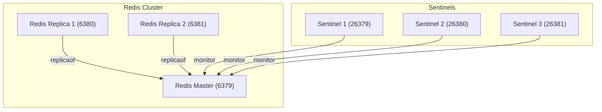

#  Redis Sentinel

이 Docker Compose 설정은 다음과 같은 Redis 고가용성(HA) 아키텍처를 구성합니다.

Sentinel은 Redis Master를 감시하고 장애 발생 시 자동으로 Replica를 승격하여 Master Failover를 수행합니다.

- Redis Master 1개
- Redis Replica 2개
- Sentinel 3개

## environment

nothing to do.

## composition

- `redis-master` : Redis Master 노드
- `redis-replica-1` : Redis Replica 노드 1
- `redis-replica-2` : Redis Replica 노드 2
- `sentinel-1` : Sentinel 인스턴스 1
- `sentinel-2` : Sentinel 인스턴스 2
- `sentinel-3` : Sentinel 인스턴스 3
- 각 노드는 고정 IP를 사용합니다.
  - `redis-master` : `172.30.0.10`
  - `redis-replica-1` : `172.30.0.11`
  - `redis-replica-2` : `172.30.0.12`
  - `sentinel-1` : `172.30.0.21`
  - `sentinel-2` : `172.30.0.22`
  - `sentinel-3` : `172.30.0.23`



## directory structure

```sh
.
├── docker-compose.yml
├── conf/
│   ├── redis-master/
│   │   └── redis.conf
│   ├── redis-replica-1/
│   │   └── redis.conf
│   └── redis-replica-2/
│       └── redis.conf
└── sentinel/
    ├── sentinel-1/
    │   └── sentinel.conf
    ├── sentinel-2/
    │   └── sentinel.conf
    └── sentinel-3/
        └── sentinel.conf
```

## run
```sh
docker compose up -d
```

이 예제는 failover 후 재기동까지 견디도록 다음 구조를 사용합니다.

- Redis는 `command --replicaof ...`가 아니라 각 노드별 `redis.conf`를 사용합니다.
- Redis와 Sentinel 모두 "파일"이 아니라 "디렉터리"를 mount해서 `CONFIG REWRITE` 결과를 디스크에 남길 수 있습니다.
- Docker DNS 해석 실패를 피하려고 내부 통신은 고정 IP 기반으로 구성했습니다.
- Redis 데이터 디렉터리(`/data`)는 프로젝트 폴더 bind mount 대신 Docker named volume을 사용합니다.

### sentinel.conf

```sh
port 26379
bind 0.0.0.0
dir /tmp

# mymaster : 감시할 마스터의 이름 (별명).
# 172.30.0.10 : 초기 마스터 Redis 인스턴스의 고정 IP.
# 6379 : 마스터 Redis의 포트.
# 2 : 몇 개의 Sentinel이 “이 노드는 죽었다” 라고 동의해야 failover가 발생하는지 설정.
# (보통 Sentinel을 3개 띄우면 2 이상 설정)
sentinel monitor mymaster 172.30.0.10 6379 2

# Failover 판정 시간
sentinel down-after-milliseconds mymaster 5000

# Failover 후 슬레이브 동기화 동시 병렬 수. 새로운 마스터가 승격된 후, 슬레이브들은 데이터를 새 마스터로 맞춰야 함. 그때 몇 개의 슬레이브가 동시에 복제 받을지를 설정 → 1개씩 순차 동기화. 그때 몇 개의 슬레이브가 동시에 복제 받을지를 설정 → 1개씩 순차 동기화.
sentinel parallel-syncs mymaster 1

# Failover 총 제한 시간. Failover가 시작된 뒤 10초(10000ms) 안에 마스터 선출과 슬레이브 재정렬이 끝나지 않으면, 다시 처음부터 선출을 시도.
sentinel failover-timeout mymaster 10000
```

### redis.conf

replica 노드는 초기 기동 시에만 기존 master를 바라보고, failover 후에는 Redis가 설정 파일을 재작성합니다.

```sh
bind 0.0.0.0
protected-mode no
port 6379

dir /data
appendonly yes
replicaof 172.30.0.10 6379
```

## verification

다음 시나리오를 실제로 확인했습니다.

- `redis-master` 중지 후 Sentinel이 `172.30.0.11`을 새 master로 승격
- old master 재기동 후 `172.30.0.11`의 replica로 복귀
- Sentinel 3개 재기동 후에도 새 master 정보를 유지

## storage

운영형에 더 가깝게 하기 위해 Redis 데이터는 호스트 프로젝트 디렉터리가 아니라 Docker volume에 저장합니다.

- `redis_master_data`
- `redis_replica_1_data`
- `redis_replica_2_data`

확인 예시:

```sh
docker volume ls | grep redis
```
