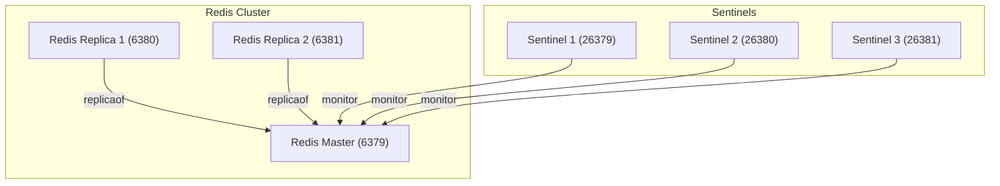

#  Redis Sentinel

이 Docker Compose 설정은 다음과 같은 Redis 고가용성(HA) 아키텍처를 구성합니다.

Sentinel은 Redis Master를 감시하고 장애 발생 시 자동으로 Replica를 승격하여 Master Failover를 수행합니다.

- Redis Master 1개
- Redis Replica 2개
- Sentinel 3개

## environment

1. 예제 폴더로 이동합니다.

```sh
cd redis/redis-sentinel
```

2. 환경 변수 파일을 준비합니다.

```sh
cp .env-sample .env
```

3. 필요하면 [`.env`](./.env)에서 다음 값을 조정합니다.

- `REDIS_VERSION`
- `REDIS_MASTER_PORT`
- `REDIS_REPLICA_1_PORT`
- `REDIS_REPLICA_2_PORT`
- `SENTINEL_1_PORT`
- `SENTINEL_2_PORT`
- `SENTINEL_3_PORT`

## composition

- `redis-master` : Redis Master 노드
- `redis-replica-1` : Redis Replica 노드 1
- `redis-replica-2` : Redis Replica 노드 2
- `sentinel-1` : Sentinel 인스턴스 1
- `sentinel-2` : Sentinel 인스턴스 2
- `sentinel-3` : Sentinel 인스턴스 3
- 각 노드는 고정 IP를 사용합니다.
  - `redis-master` : `172.30.0.10`
  - `redis-replica-1` : `172.30.0.11`
  - `redis-replica-2` : `172.30.0.12`
  - `sentinel-1` : `172.30.0.21`
  - `sentinel-2` : `172.30.0.22`
  - `sentinel-3` : `172.30.0.23`



## directory structure

```sh
.
├── docker-compose.yml
├── conf/
│   ├── redis-master/
│   │   └── redis.conf
│   ├── redis-replica-1/
│   │   └── redis.conf
│   └── redis-replica-2/
│       └── redis.conf
├── scripts/
│   └── bootstrap-config.sh
└── sentinel/
    ├── sentinel-1/
    │   └── sentinel.conf
    ├── sentinel-2/
    │   └── sentinel.conf
    └── sentinel-3/
        └── sentinel.conf
```

## run
```sh
docker compose up -d
```

이 예제는 failover 후 재기동까지 견디도록 다음 구조를 사용합니다.

- Redis는 `command --replicaof ...`가 아니라 각 노드별 `redis.conf`를 사용합니다.
- 기본 `redis.conf`, `sentinel.conf`는 템플릿 디렉터리에서 읽기 전용으로 mount합니다.
- 실제로 Redis와 Sentinel이 사용하는 설정 파일은 별도 named volume에 저장됩니다.
- 컨테이너 시작 시 `bootstrap-config.sh`가 runtime 설정 파일이 없을 때만 템플릿을 복사합니다.
- Docker DNS 해석 실패를 피하려고 내부 통신은 고정 IP 기반으로 구성했습니다.
- Redis 데이터 디렉터리(`/data`)는 프로젝트 폴더 bind mount 대신 Docker named volume을 사용합니다.

### sentinel.conf

```sh
port 26379
bind 0.0.0.0
dir /tmp

# mymaster : 감시할 마스터의 이름 (별명).
# 172.30.0.10 : 초기 마스터 Redis 인스턴스의 고정 IP.
# 6379 : 마스터 Redis의 포트.
# 2 : 몇 개의 Sentinel이 “이 노드는 죽었다” 라고 동의해야 failover가 발생하는지 설정.
# (보통 Sentinel을 3개 띄우면 2 이상 설정)
sentinel monitor mymaster 172.30.0.10 6379 2

# Failover 판정 시간
sentinel down-after-milliseconds mymaster 5000

# Failover 후 슬레이브 동기화 동시 병렬 수. 새로운 마스터가 승격된 후, 슬레이브들은 데이터를 새 마스터로 맞춰야 함. 그때 몇 개의 슬레이브가 동시에 복제 받을지를 설정 → 1개씩 순차 동기화. 그때 몇 개의 슬레이브가 동시에 복제 받을지를 설정 → 1개씩 순차 동기화.
sentinel parallel-syncs mymaster 1

# Failover 총 제한 시간. Failover가 시작된 뒤 10초(10000ms) 안에 마스터 선출과 슬레이브 재정렬이 끝나지 않으면, 다시 처음부터 선출을 시도.
sentinel failover-timeout mymaster 10000
```

### redis.conf

replica 노드는 초기 기동 시에만 기존 master를 바라보고, failover 후에는 Redis가 설정 파일을 재작성합니다.

```sh
bind 0.0.0.0
protected-mode no
port 6379

dir /data
appendonly yes
replicaof 172.30.0.10 6379
```

## verification

다음 시나리오를 실제로 확인했습니다.

- `redis-master` 중지 후 Sentinel이 `172.30.0.11`을 새 master로 승격
- old master 재기동 후 `172.30.0.11`의 replica로 복귀
- Sentinel 3개 재기동 후에도 새 master 정보를 유지

## failover test

아래 순서로 실제 failover를 수동 검증할 수 있습니다.

### 1. 스택 기동

```sh
docker compose up -d
```

### 2. 초기 master 확인

```sh
docker exec redis-sentinel-1 redis-cli -p 26379 SENTINEL get-master-addr-by-name mymaster
```

기대 결과:

```sh
172.30.0.10
6379
```

### 3. Redis 복제 상태 확인

```sh
docker exec redis-master redis-cli INFO replication
docker exec redis-replica-1 redis-cli INFO replication
docker exec redis-replica-2 redis-cli INFO replication
```

기대 결과:

- `redis-master`는 `role:master`
- `redis-replica-1`, `redis-replica-2`는 `role:slave`

### 4. master 중지

```sh
docker stop redis-master
```

### 5. failover 완료 대기 후 새 master 확인

Sentinel election과 failover timeout 때문에 수 초에서 수십 초 정도 걸릴 수 있습니다.

```sh
docker exec redis-sentinel-1 sh -c 'sleep 25; redis-cli -p 26379 SENTINEL get-master-addr-by-name mymaster'
```

기대 결과 예시:

```sh
172.30.0.11
6379
```

또는

```sh
172.30.0.12
6379
```

둘 중 하나 replica가 새 master로 승격되면 정상입니다.

### 6. 승격된 master와 남은 replica 상태 확인

예를 들어 새 master가 `172.30.0.12`라면:

```sh
docker exec redis-replica-2 redis-cli INFO replication
docker exec redis-replica-1 redis-cli INFO replication
```

기대 결과:

- 승격된 노드는 `role:master`
- 다른 replica는 새 master를 바라보는 `role:slave`

### 7. old master 재기동

```sh
docker start redis-master
```

### 8. old master가 replica로 복귀했는지 확인

```sh
docker exec redis-master sh -c 'sleep 12; redis-cli INFO replication'
```

기대 결과:

- `role:slave`
- `master_host`가 새 master IP(`172.30.0.11` 또는 `172.30.0.12`)로 표시됨

### 9. Sentinel 재기동 후 상태 유지 확인

```sh
docker restart redis-sentinel-1 redis-sentinel-2 redis-sentinel-3
docker exec redis-sentinel-1 sh -c 'sleep 4; redis-cli -p 26379 SENTINEL get-master-addr-by-name mymaster'
```

기대 결과:

- failover 후 선출된 master IP가 그대로 유지됨

### 10. 테스트 정리

```sh
docker compose down
```

현재 failover 상태까지 완전히 초기화하고 템플릿 기준으로 다시 시작하고 싶다면 위의 `config volume reset` 절차를 함께 수행합니다.

## storage

운영형에 더 가깝게 하기 위해 Redis 데이터는 호스트 프로젝트 디렉터리가 아니라 Docker volume에 저장합니다.

- `redis_master_data`
- `redis_replica_1_data`
- `redis_replica_2_data`
- `redis_master_config`
- `redis_replica_1_config`
- `redis_replica_2_config`
- `sentinel_1_config`
- `sentinel_2_config`
- `sentinel_3_config`

확인 예시:

```sh
docker volume ls | grep redis
```

## config volume reset

템플릿(`conf/.../redis.conf`, `sentinel/.../sentinel.conf`)을 수정한 뒤 그 변경을 반영하려면, 기존 runtime config volume을 초기화해야 합니다.

이유:

- `bootstrap-config.sh`는 runtime config 파일이 없을 때만 템플릿을 복사합니다.
- 따라서 volume 안에 기존 `redis.conf`, `sentinel.conf`가 남아 있으면 템플릿 변경이 자동 반영되지 않습니다.

초기화 순서:

```sh
docker compose down
docker volume rm \
  redis-sentinel_redis_master_config \
  redis-sentinel_redis_replica_1_config \
  redis-sentinel_redis_replica_2_config \
  redis-sentinel_sentinel_1_config \
  redis-sentinel_sentinel_2_config \
  redis-sentinel_sentinel_3_config
docker compose up -d
```

데이터 volume까지 같이 지우고 완전 초기화하고 싶다면 아래 volume도 추가로 제거합니다.

```sh
docker volume rm \
  redis-sentinel_redis_master_data \
  redis-sentinel_redis_replica_1_data \
  redis-sentinel_redis_replica_2_data
```

주의:

- config volume만 지우면 설정 파일만 템플릿 기준으로 재생성되고, Redis 데이터는 유지됩니다.
- data volume까지 지우면 Redis 데이터도 모두 삭제됩니다.
