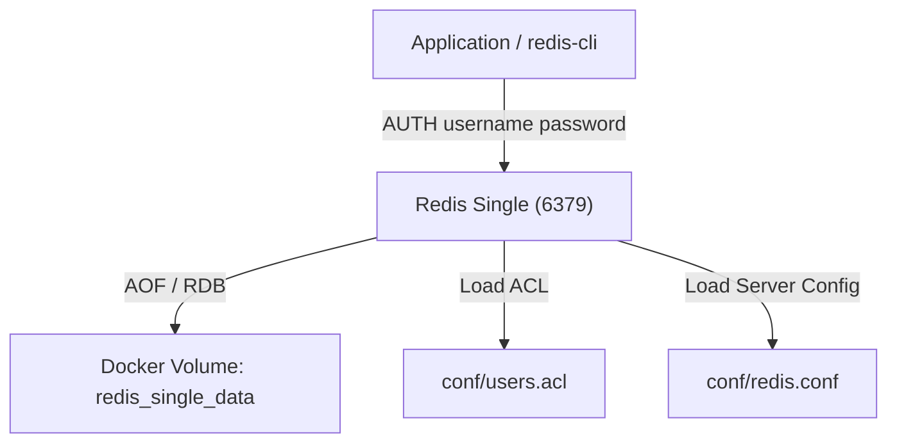

# Redis Single

이 Docker Compose 설정은 단일 Redis 인스턴스를 실행합니다.

기본 예제와 달리, 이 구성은 `redis.conf`와 `users.acl`을 분리하여 다음 요구를 반영합니다.

- 설정 파일 기반 실행
- AOF 영속화 활성화
- 비밀번호 기반 ACL 인증 적용
- 읽기 전용 사용자와 일반 사용자 분리

## environment

1. 예제 폴더로 이동합니다.

```sh
cd redis/redis-single
```

2. 환경 변수 파일을 준비합니다.

```sh
cp .env-sample .env
```

3. 필요하면 [`.env`](./.env)에서 다음 값을 조정합니다.

- `REDIS_VERSION`
- `REDIS_PORT`
- `REDIS_APP_USERNAME`
- `REDIS_APP_PASSWORD`
- `REDIS_READONLY_USERNAME`
- `REDIS_READONLY_PASSWORD`

## composition

- `redis-single` : 단일 Redis 노드



## directory structure

```sh
.
├── docker-compose.yml
├── README.md
├── conf/
│   └── redis.conf
└── scripts/
    └── bootstrap-config.sh
```

## run

```sh
docker compose up -d
```

## auth

기본 `default` 사용자는 비활성화되어 있으므로, 접속 시 반드시 ACL 사용자명과 비밀번호를 함께 전달해야 합니다.

- 일반 사용자
  - username 예시: `app`
  - password 예시: `app-password-123`
- 읽기 전용 사용자
  - username 예시: `readonly`
  - password 예시: `readonly-password-123`

예시:

```sh
redis-cli -h 127.0.0.1 -p 6379 --user app --pass app-password-123 PING
redis-cli -h 127.0.0.1 -p 6379 --user readonly --pass readonly-password-123 GET sample:key
```

## redis.conf

```sh
bind 0.0.0.0
protected-mode yes
port 6379

dir /data

appendonly yes
appendfilename "appendonly.aof"
save 3600 1 300 100 60 10000

aclfile /usr/local/etc/redis/users.acl

loglevel notice
```

- `bind 0.0.0.0`
  - 컨테이너 외부에서 접속할 수 있도록 모든 인터페이스에 바인딩합니다.
- `protected-mode yes`
  - 인증 없이 임의 접근되는 구성을 방지합니다.
- `appendonly yes`
  - 모든 쓰기 명령을 AOF로 기록하여 재시작 후 복구를 돕습니다.
- `aclfile`
  - 사용자별 권한과 비밀번호를 Redis 서버 설정과 분리합니다.

## users.acl

`users.acl`은 Git에 고정 파일로 두지 않고, 컨테이너 시작 시 [`.env`](./.env) 값을 읽어 `/usr/local/etc/redis/users.acl`로 생성합니다.

생성되는 형식은 아래와 같습니다.

```sh
user default off sanitize-payload resetchannels -@all
user ${REDIS_APP_USERNAME} on >${REDIS_APP_PASSWORD} ~* &* +@all
user ${REDIS_READONLY_USERNAME} on >${REDIS_READONLY_PASSWORD} ~* &* -@all +@read +ping +info
```

- `user default off`
  - 익명 기본 사용자를 비활성화합니다.
- `user app on ... +@all`
  - `.env`의 `REDIS_APP_USERNAME`, `REDIS_APP_PASSWORD`로 생성되는 애플리케이션용 일반 사용자입니다.
- `user readonly on ... +@read`
  - `.env`의 `REDIS_READONLY_USERNAME`, `REDIS_READONLY_PASSWORD`로 생성되는 조회 전용 사용자입니다.

## notes

- Redis 데이터는 호스트 폴더가 아니라 Docker named volume `redis_single_data`에 저장됩니다.
- 실제 사용 시에는 [`.env`](./.env)의 예시 비밀번호를 반드시 변경해야 합니다.
- 애플리케이션에서도 Redis URI 대신 ACL 사용자명 기반 인증 설정을 함께 맞춰야 합니다.
